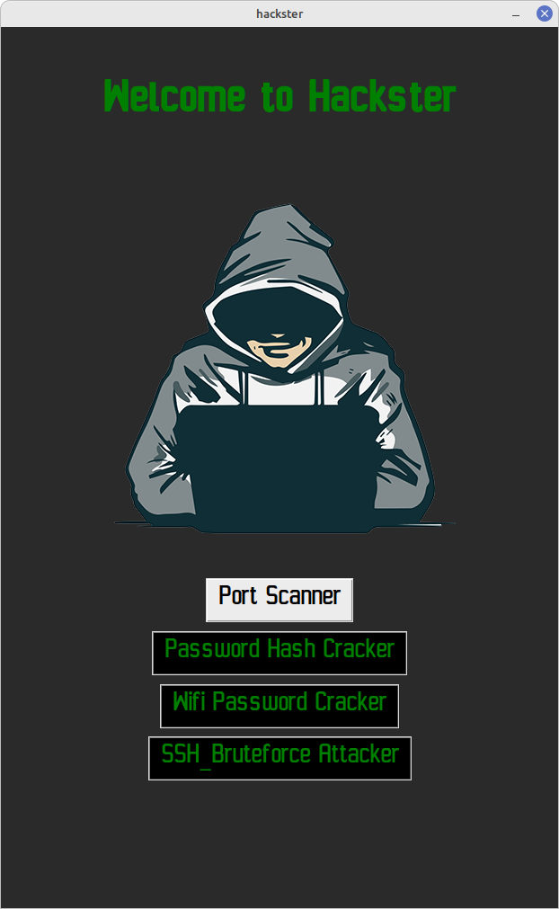
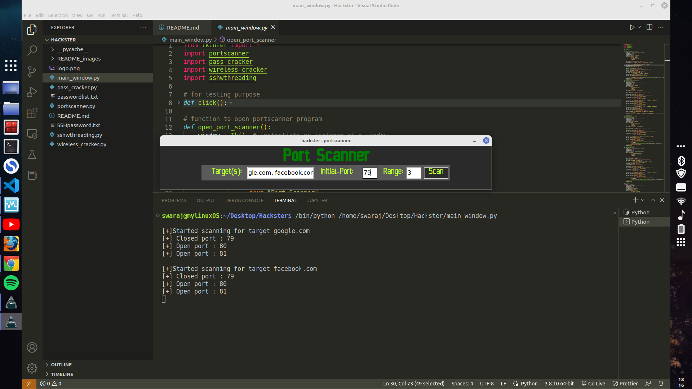
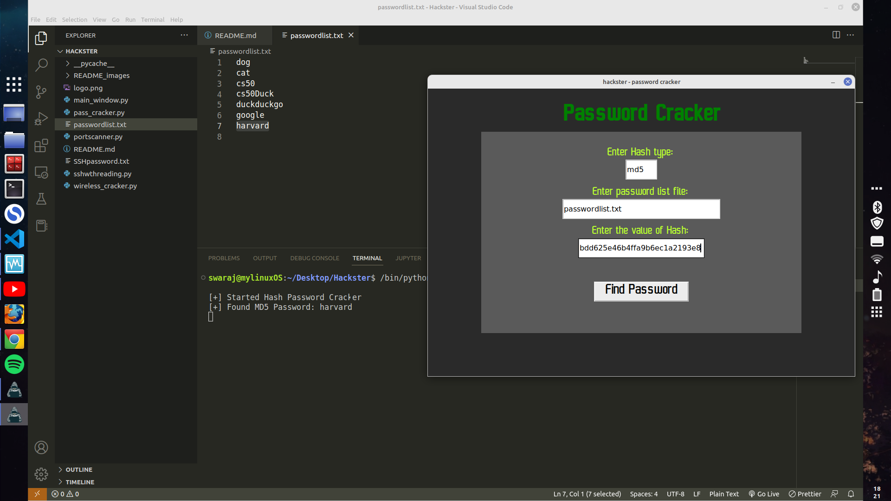
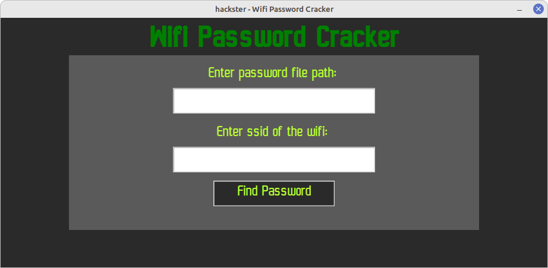
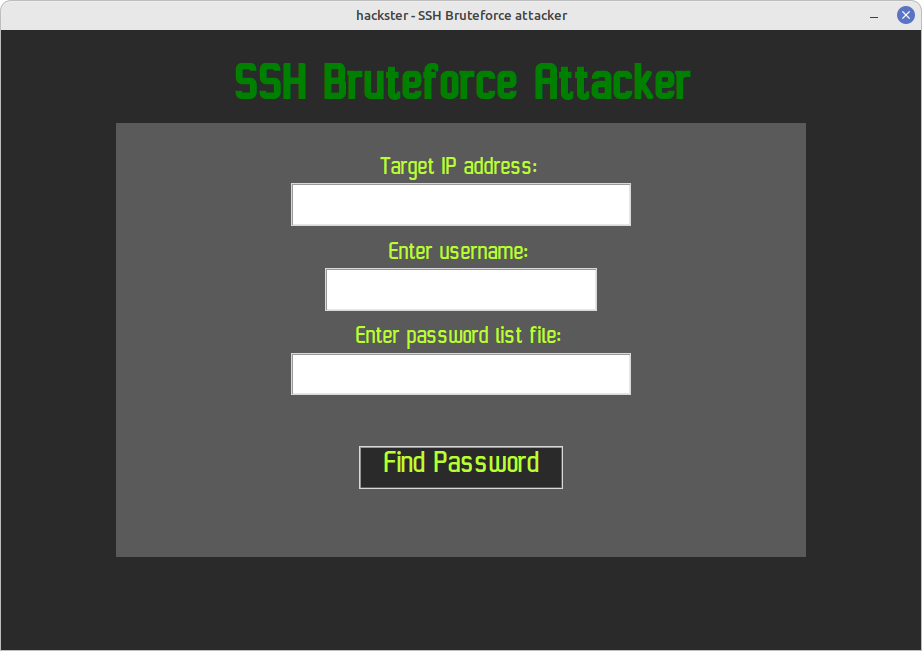

# Hackster

A simple hacking application



## Description
Hackster is an application which has many uses which are as follows: 
* Scan any port of any IP address and public domain name and find which ports are open along with the services they use.

* Crack passwords using their Hash values if the hash encryption of password is done in md5, sha1 or sha256.

* It consists of a wifi password cracker which can crack passwords of wireless internet provider connected to the machine.

* It has a SSH bruteforce attacker which can crack passwords of a SSH user.<br>

* It has a keylogger too, which can track the key presses on the victims computer.<br>


## Getting Started

### Dependencies

* Recommended Operating System : Any recent version of Linux distributions (I use [Linux Mint](https://linuxmint.com/))
* [Python](https://www.python.org/downloads/) must be installed (any version above 3) and its required modules:
    * hashlib 
    * IPy
    * paramiko
    * wireless 
    * termcolor
    * tkinter
    * socket
    * os
    * threading
    * time
    * pynput


### Modules and packages installation guide  

#### This installation guide is for ubuntu distributions

* Pip must be installed to download required python modules mentioned above
```
sudo apt install python3-pip
```
* Install python-is-python3
```
sudo apt install python-is-python3
```
* To install the modules mentioned above
```
pip3 install {module-name}
```

### How to start the application

* Step 1: Open the project directory
* Step 2: Open the terminal in the present working directory i.e. the project directory.
* Step 3: run the following command on the terminal
```
python main_window.py
```

### How to use the application

Check out my demonstration on the [@youtube](https://www.youtube.com/).


## Author

*  SWARAJ KUMAR BISWAL

### Follow me on:
* [@facebook](https://www.facebook.com/profile.php?id=100087323571590)
* [@instagram](https://www.instagram.com/biswalswaraj_42/)
* [@linkedin](https://www.linkedin.com/in/swaraj-biswal-2a8771252/)
* [@quora](https://www.quora.com/profile/Swaraj-Biswal-8)

## Acknowledgments

Inspiration, code snippets, etc.

* This project is an inspiration from a udemy
[course](https://twitter.com/dompizzie) made by [Aleksa Tamburkovski](https://www.udemy.com/user/aleksa-31/) and [Joe Parys](https://www.udemy.com/user/josephparys/), Their course teaches you how to build 8 command line python hacking tools.I learnt to make all of their tools and selected 5 of them adding some extra features along with GUI interface for input and command line output in this project.

* For adding GUI interface to the program I used a python library [Tkinter](https://docs.python.org/3/library/tkinter.html) and the tutorial I took help from a youtuber [Keith Galli](https://www.youtube.com/@KeithGalli) his GUI project helped me to build mine checkout his [video](https://www.youtube.com/watch?v=D8-snVfekto&t=3240s).

